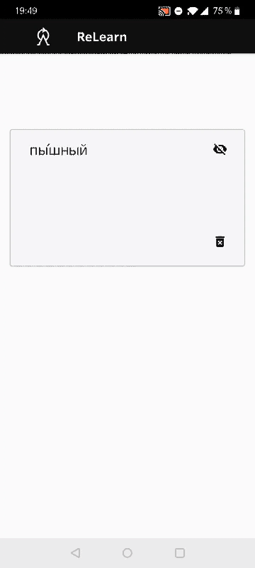

# What is this?

ReLearn is an Android application that is aimed to support language learners through repetition. ReLearn takes note of every new word the user encounters and prompts them later.
 
# Features

ReLearn works by building a database of words and expressions that you looked up. An entry is randomly selected to be prompted from the database each time you request a new word to be shown. A more detailed list of features:

- ReLearn currently has two data sources: 
  - the Google Translate app, 
  - `wiktionary.com` (if opened in Chrome or Firefox)
- Currently, only Russian is supported, but adding support for new languages is planned.
- Words as flashcards.
- Daily notifications of the current item at 20:30. The next item is shown upon request.
- Delete irrelevant entries.
- View entries in their original format (Google Translate or on wiktionary.com) by tapping on the cards.
- Complete dark mode support.

# Installation

The app is not yet published to Google Play, but you can grab the APK from latest release here on GitHub (built by GitHub Actions).
